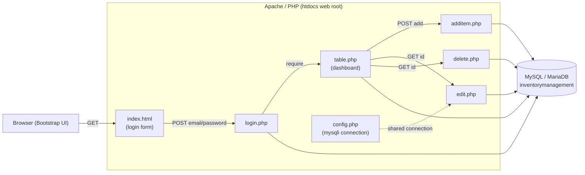
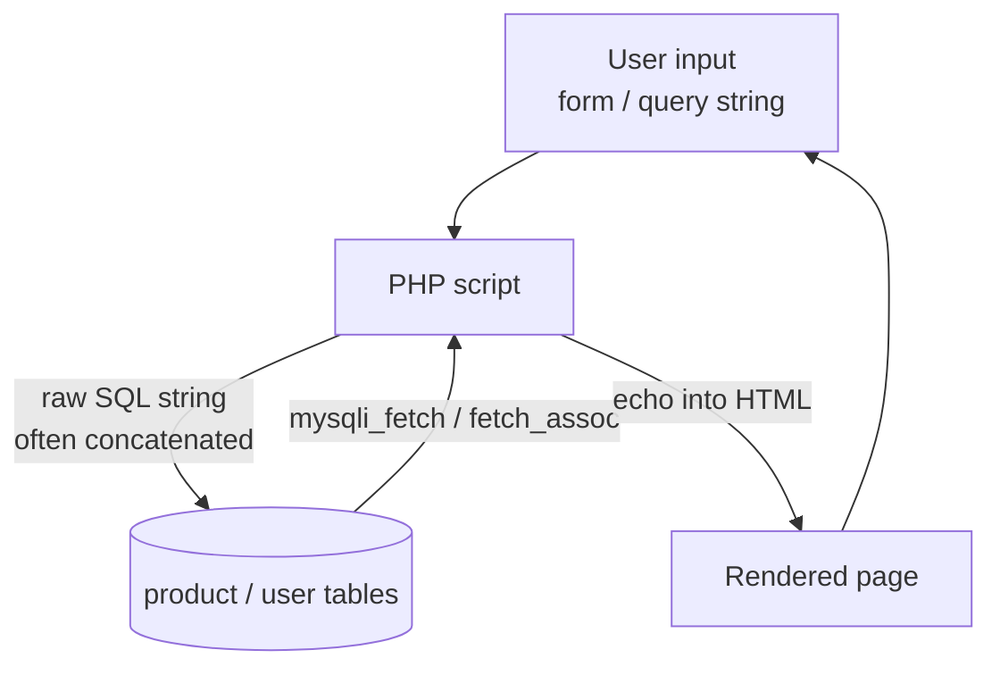
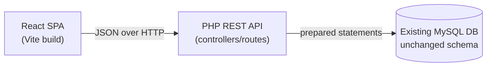

# Architecture

## 1. Architecture Overview

The system is a classic LAMP-style, server-rendered PHP application with no framework, no routing layer, and no separation between presentation, business logic, and data access. Each PHP file in the web root acts as both a page and an action handler, emitting HTML directly while also executing SQL against a MySQL/MariaDB database. State is not tracked between requests — there is no session layer — so navigation flows by directly requesting `.php` files or by one script `require`-ing another. Bootstrap provides styling on the client; all rendering happens on the server.

## 2. High-Level Architecture



- **Presentation tier:** HTML generated inline by PHP, styled with Bootstrap 5.3 (CDN in some pages, local assets in others).
- **Application tier:** Individual procedural PHP scripts; no controllers, services, or models.
- **Data tier:** A single MySQL/MariaDB database `inventorymanagement` with two tables, `product` and `user`.

## 3. Folder Structure

```
/ (web root, htdocs)
├── index.html              # Login page (entry point)
├── login.php               # Authenticates, then require()s table.php
├── table.php               # Dashboard: add-item form + product list
├── additem.php             # Handles product insert
├── edit.php                # Loads + updates a product
├── delete.php              # Deletes a product
├── config.php              # Shared mysqli connection
├── inventorymanagement.sql # DB schema + seed data
├── README.md
├── assets/
│   ├── css/  bootstrap.min.css, login.css
│   ├── images/             # logos, favicon
│   └── js/   bootstrap.min.js
└── context/
    ├── PROJECT_OVERVIEW.md
    └── ARCHITECTURE.md      # This document
```

Everything is flat in the web root; any file is directly reachable by URL.

## 4. Request Flow

1. **Login:** The browser loads [index.html](../index.html) and submits the form (`POST`) to [login.php](../login.php).
2. **Authentication:** [login.php](../login.php) opens its own `mysqli` connection and runs a `SELECT` against `user` with the submitted email/password. On a single-row match it `require`s [table.php](../table.php) (rendering the dashboard inline within the same request); otherwise it prints a failure message.
3. **Dashboard:** [table.php](../table.php) opens a connection, `SELECT`s all rows from `product`, and renders them in a table plus an "Add Item" form.
4. **Create:** The add form `POST`s to [additem.php](../additem.php), which `INSERT`s the product and then `require`s [table.php](../table.php) again to redisplay the list.
5. **Update:** An "Edit" link performs `GET edit.php?id=...`; [edit.php](../edit.php) loads that product, and its form `POST`s back to update it, then `header("Location: table.php")`.
6. **Delete:** A "Delete" link performs `GET delete.php?id=...`; [delete.php](../delete.php) deletes the row and redirects to [table.php](../table.php).

## 5. Module Organization

There is no formal module system; each file is a self-contained unit combining routing, logic, and view:

- **Entry / Auth:** [index.html](../index.html), [login.php](../login.php)
- **Read / Dashboard:** [table.php](../table.php)
- **Create:** [additem.php](../additem.php)
- **Update:** [edit.php](../edit.php)
- **Delete:** [delete.php](../delete.php)
- **Infrastructure:** [config.php](../config.php) (intended shared connection), [inventorymanagement.sql](../inventorymanagement.sql) (schema/seed)
- **Static assets:** `assets/css`, `assets/js`, `assets/images`

Notably, only [edit.php](../edit.php) uses `config.php`; [login.php](../login.php), [additem.php](../additem.php), [delete.php](../delete.php), and [table.php](../table.php) each open their own hardcoded connections.

## 6. Data Flow



- Input arrives via `$_POST` (login, add, edit) or `$_GET` (edit/delete `id`).
- Some writes use `mysqli_real_escape_string` ([additem.php](../additem.php), [edit.php](../edit.php)), but reads/deletes concatenate input directly ([login.php](../login.php), [delete.php](../delete.php)).
- Results are fetched with `mysqli` and echoed straight into markup with no output encoding.
- **Data model:** `product` (`product_id` PK, `product_name`, `price`, `quantity`) and `user` (`id` PK, `email`, `password`).

## 7. External Integrations

- **Bootstrap 5.3** — CSS/JS, loaded from the jsDelivr CDN in [table.php](../table.php) and [edit.php](../edit.php), and also bundled locally in `assets/`.
- **MySQL / MariaDB** — the only backing service, accessed via the `mysqli` extension.
- No third-party APIs, authentication providers, payment gateways, mail services, or package managers are integrated.

## 8. Security Architecture

The current design has minimal security controls and several critical gaps:

- **No session / access control:** Authentication in [login.php](../login.php) never calls `session_start()`; it simply `require`s the dashboard. Protected scripts ([table.php](../table.php), [additem.php](../additem.php), [edit.php](../edit.php), [delete.php](../delete.php)) have no guard and are reachable directly by URL, fully bypassing login.
- **SQL injection:** The login `SELECT` and the [delete.php](../delete.php) `DELETE` concatenate raw user input into SQL. `edit.php` also interpolates `$_GET['id']` into the `SELECT`.
- **Plaintext passwords:** The `user` table stores and compares passwords in plaintext.
- **No output escaping (XSS):** Product fields are echoed into HTML without `htmlspecialchars`, allowing stored XSS.
- **No CSRF protection:** State-changing actions (add/edit/delete) accept requests with no anti-CSRF tokens; delete/edit even act on `GET`.
- **Hardcoded credentials:** DB credentials (`root`, empty password) are embedded in multiple files.

## 9. Current Architectural Limitations

- **No separation of concerns:** HTML, business logic, and SQL are interleaved in every file.
- **No routing / front controller:** Every `.php` file is a public endpoint; there is no central request handling.
- **No reusable data layer:** Redundant, inconsistent DB connections (procedural `mysqli_connect` vs. object-oriented `new mysqli`) instead of a shared abstraction.
- **No state management:** Absence of sessions makes real authentication and per-user context impossible.
- **PRG violations & bugs:** [additem.php](../additem.php) re-renders via `require` (risking duplicate submissions on refresh), and [table.php](../table.php) contains malformed `<a href="up"` action links.
- **No tests, build, or dependency tooling:** No Composer/npm, no automated tests, no migrations.

## 10. Modernization Considerations (without refactoring database part. only frontend to react and backend api's)

Keeping the existing MySQL schema (`product`, `user`) untouched, the application can be re-architected into a decoupled SPA + API design:



- **Backend → REST API:** Convert each current page action into a JSON endpoint, e.g. `POST /api/login`, `GET /api/products`, `POST /api/products`, `PUT /api/products/{id}`, `DELETE /api/products/{id}`. Endpoints read/write the *same* `product` and `user` tables.
- **Introduce a data-access layer:** Centralize the connection in [config.php](../config.php) and use **prepared statements** everywhere to eliminate SQL injection — without changing table structures.
- **Stateless auth:** Replace the `require`-based login with token-based auth (e.g., JWT) or PHP sessions returning JSON, so the React client can authenticate and attach a token to subsequent requests.
- **Frontend → React:** Rebuild [index.html](../index.html) and [table.php](../table.php) as React components/pages (login view, product list, add/edit modals) that call the API and render results client-side, replacing server-echoed HTML.
- **Cross-cutting:** Apply consistent JSON responses/HTTP status codes, CORS configuration, server-side validation, output/content-type handling, and CSRF/token protection at the API boundary.
- **Out of scope by request:** The database schema, engine, and seed data remain as-is; only the presentation (→ React) and application tier (→ REST APIs) are modernized.

## 11. AI Implementation Notes

- **Preserve the schema:** Any generated code must target the existing `product` (`product_id`, `product_name`, `price`, `quantity`) and `user` (`id`, `email`, `password`) tables without altering columns or types.
- **Security first:** When touching data access, always use parameterized/prepared statements, hash passwords (`password_hash`/`password_verify`) on migration, and escape any server-rendered output.
- **Endpoint mapping:** Map legacy files to API routes 1:1 — [login.php](../login.php)→auth, [table.php](../table.php)→list, [additem.php](../additem.php)→create, [edit.php](../edit.php)→update, [delete.php](../delete.php)→delete.
- **Consistency:** Consolidate on a single connection style/config ([config.php](../config.php)); do not reintroduce per-file hardcoded connections.
- **Correctness fixes to carry over:** Use HTTP redirects (PRG) for writes, move edit/delete off `GET` to `PUT`/`DELETE`, and fix the malformed action links from [table.php](../table.php).
- **Validation boundaries:** Validate and type-check `id`, `price`, and `quantity` server-side before any query.