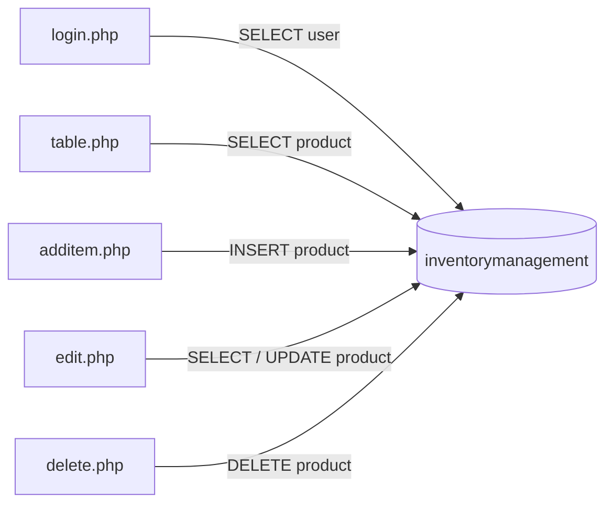

# Database

## 1. Database Overview

The application uses a single relational database named `inventorymanagement` with two independent tables: `product` (the inventory catalog) and `user` (login accounts). The schema is minimal — no relationships, views, procedures, triggers, or secondary indexes — and is provisioned by importing the phpMyAdmin dump [inventorymanagement.sql](../inventorymanagement.sql).

## 2. Database Technology

- **Engine:** MySQL / MariaDB (dump generated on MariaDB 10.4.27, phpMyAdmin 5.2.0, PHP 8.2.0).
- **Storage engine:** InnoDB for both tables.
- **Access layer:** PHP `mysqli` extension (both procedural and object-oriented usage across files).
- **Character sets (inconsistent):** `product` uses `latin1` / `latin1_swedish_ci`; `user` uses `utf8mb4` / `utf8mb4_general_ci`.

## 3. Database Configuration

- **Host:** `localhost` (dump header references `127.0.0.1`).
- **Database name:** `inventorymanagement`.
- **User / password:** `root` with an empty password (hardcoded).
- **Shared connection:** defined in [config.php](../config.php), but only [edit.php](../edit.php) uses it; [login.php](../login.php), [additem.php](../additem.php), [delete.php](../delete.php), and [table.php](../table.php) open their own hardcoded connections.

## 4. Tables

### `product`

| Column         | Type          | Constraints              | Notes                     |
| -------------- | ------------- | ------------------------ | ------------------------- |
| `product_id`   | `int(20)`     | NOT NULL, AUTO_INCREMENT | Primary key               |
| `product_name` | `varchar(30)` | NOT NULL                 | Capped at 30 characters   |
| `price`        | `float`       | NOT NULL                 | Floating-point currency   |
| `quantity`     | `int(10)`     | NOT NULL                 | Stock level               |

- Seeded with 13 Apple products; `AUTO_INCREMENT` next value is 15 (ID 13 is absent).

### `user`

| Column     | Type          | Constraints              | Notes                    |
| ---------- | ------------- | ------------------------ | ------------------------ |
| `id`       | `int(10)`     | NOT NULL, AUTO_INCREMENT | Primary key              |
| `email`    | `varchar(50)` | NOT NULL                 | Login identifier         |
| `password` | `varchar(50)` | NOT NULL                 | Stored in plaintext      |

- Seeded with one account: `admin@apple.com` / `admin`; `AUTO_INCREMENT` next value is 3.

## 5. Relationships

- None. The `product` and `user` tables are entirely independent — there are no relationships defined between them, and product records are not associated with any user.

## 6. Primary Keys

- `product.product_id` — `PRIMARY KEY`, `AUTO_INCREMENT`.
- `user.id` — `PRIMARY KEY`, `AUTO_INCREMENT`.

## 7. Foreign Keys

- None defined. There is no referential integrity enforced at the database level.

## 8. Views

- None.

## 9. Stored Procedures / Functions

- None.

## 10. Triggers

- None.

## 11. Indexes

- Only the primary-key indexes exist (`product_id`, `id`). No secondary, unique, or composite indexes are defined — notably, `user.email` is not unique.

## 12. Data Flow

- **Reads:** [login.php](../login.php) selects from `user`; [table.php](../table.php) and [edit.php](../edit.php) select from `product`.
- **Writes:** [additem.php](../additem.php) inserts, [edit.php](../edit.php) updates, [delete.php](../delete.php) deletes — all against `product`.
- Some writes escape input with `mysqli_real_escape_string`, but several queries concatenate raw input directly.

## 13. Known Database Issues

- **Plaintext passwords:** `user.password` stores credentials unhashed.
- **No unique constraint on `email`:** duplicate accounts are possible.
- **SQL injection exposure:** raw input is concatenated into queries in [login.php](../login.php), [delete.php](../delete.php), and the [edit.php](../edit.php) load query.
- **Inconsistent charsets:** `latin1` (product) vs. `utf8mb4` (user) can cause encoding issues; `latin1` cannot store many Unicode characters.
- **`float` for price:** floating-point is imprecise for currency; `DECIMAL` is preferred.
- **Oversized/loose types:** `int(20)`/`varchar(30)` display widths and tight lengths (30-char names, 50-char password) may be too restrictive or misleading.
- **No FKs / integrity:** nothing links products to users or enforces valid references.

## 14. Modernization Considerations

Per the agreed scope, the schema stays functionally intact (React frontend + PHP REST API only), but low-risk, backward-compatible hardening is recommended:

- **Access via prepared statements** from the new API layer — no schema change required to eliminate injection.
- **Hash passwords** on migration (`password_hash`) and widen `user.password` to `varchar(255)` to fit hashes.
- **Add a unique index** on `user.email`.
- **Normalize charset** to `utf8mb4` across both tables for consistency.
- **Consider `DECIMAL(10,2)`** for `price` if a data migration is later approved.
- Keep table/column names stable so existing API mappings remain valid.

## 15. AI Notes

- **Target schema exactly:** `product` (`product_id`, `product_name`, `price`, `quantity`) and `user` (`id`, `email`, `password`) — do not rename or drop columns.
- **Always parameterize:** never concatenate `id`, `email`, `password`, `price`, or `quantity` into SQL; use bound parameters.
- **Password handling:** on any auth work, migrate to hashed passwords and verify with `password_verify`; account for the widened column.
- **Connection source of truth:** use [config.php](../config.php) for the single connection; do not reintroduce per-file hardcoded credentials.
- **Type awareness:** treat `price` as float in the current DB (watch for rounding); validate `quantity` and `id` as positive integers before querying.
- **Seed data:** the existing admin account and 13 product rows are the baseline test fixtures.