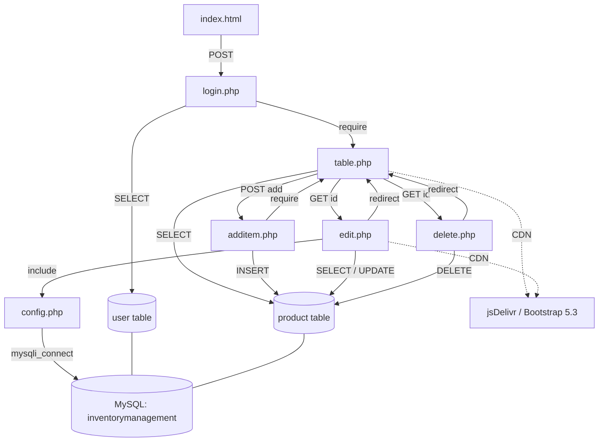

# Dependency Map

## 1. Overview

This document maps how the application's files, functions, database, and external services depend on one another. Because the system is flat procedural PHP with no framework, dependencies are expressed through direct `require`/`include` calls, HTML form `action` targets, `header()` redirects, and shared use of the MySQL database. There is no dependency-injection or module system — coupling is file-to-file and file-to-database.

## 2. Module Dependencies

- **Authentication** ([index.html](../index.html) → [login.php](../login.php)) depends on the `user` table and, on success, on the **Dashboard** module.
- **Dashboard** ([table.php](../table.php)) depends on the `product` table and is the redirect/redisplay target of **Add**, **Edit**, and **Delete**.
- **Add** ([additem.php](../additem.php)), **Edit** ([edit.php](../edit.php)), **Delete** ([delete.php](../delete.php)) each depend on the `product` table and on the Dashboard as their post-action destination.
- **Infrastructure** ([config.php](../config.php)) is a shared connection provider — but only Edit consumes it.

## 3. File Dependencies

| File | Depends on | Mechanism |
| ---- | ---------- | --------- |
| [index.html](../index.html) | [login.php](../login.php) | form `action` (POST) |
| [login.php](../login.php) | [table.php](../table.php), `user` table | `require('./table.php')`, own `mysqli` connection |
| [table.php](../table.php) | [additem.php](../additem.php), [edit.php](../edit.php), [delete.php](../delete.php), `product` table | form `action`, `<a>` links, own `new mysqli` |
| [additem.php](../additem.php) | [table.php](../table.php), `product` table | `require('./table.php')`, own `mysqli` connection |
| [edit.php](../edit.php) | [config.php](../config.php), [table.php](../table.php), `product` table | `include('config.php')`, `header("Location: table.php")` |
| [delete.php](../delete.php) | [table.php](../table.php), `product` table | `header("Location: table.php")`, own `mysqli` connection |
| [config.php](../config.php) | `mysqli` extension, MySQL | `mysqli_connect(...)` |

## 4. Function Dependencies

- **`mysqli_connect` / `new mysqli`** — used independently in [login.php](../login.php), [table.php](../table.php), [additem.php](../additem.php), [delete.php](../delete.php), and [config.php](../config.php) (redundant connection setup).
- **`mysqli_query` / `->query()`** — every data operation depends on this for SELECT/INSERT/UPDATE/DELETE.
- **`mysqli_fetch_array` / `->fetch_assoc()`** — [login.php](../login.php), [table.php](../table.php), [edit.php](../edit.php) depend on these to read results.
- **`mysqli_real_escape_string`** — [additem.php](../additem.php) and [edit.php](../edit.php) depend on it for partial input escaping (not used in [login.php](../login.php)/[delete.php](../delete.php)).
- **`header()`** — [edit.php](../edit.php) and [delete.php](../delete.php) depend on it for post-action redirects.

## 5. Database Dependencies

- **`user` table** ← [login.php](../login.php) (SELECT).
- **`product` table** ← [table.php](../table.php) (SELECT), [additem.php](../additem.php) (INSERT), [edit.php](../edit.php) (SELECT/UPDATE), [delete.php](../delete.php) (DELETE).
- All files ultimately depend on the `inventorymanagement` database being provisioned from [inventorymanagement.sql](../inventorymanagement.sql).

## 6. External Service Dependencies

- **jsDelivr CDN** — [table.php](../table.php) and [edit.php](../edit.php) depend on it for Bootstrap 5.3 CSS/JS at render time.
- No other external services or APIs are depended upon.

## 7. Shared Components

- **[config.php](../config.php)** — the intended shared DB connection (currently used only by [edit.php](../edit.php)).
- **[table.php](../table.php)** — the shared dashboard/view, reused by [login.php](../login.php) and [additem.php](../additem.php) via `require` and by [edit.php](../edit.php)/[delete.php](../delete.php) via redirect.
- **`assets/`** — shared Bootstrap CSS/JS and images.

## 8. Critical Dependency Chains

- **Login flow:** [index.html](../index.html) → [login.php](../login.php) → (`user` table) → `require` [table.php](../table.php) → (`product` table).
- **Add flow:** [table.php](../table.php) form → [additem.php](../additem.php) → (`product` INSERT) → `require` [table.php](../table.php).
- **Edit flow:** [table.php](../table.php) link → [edit.php](../edit.php) (`include` [config.php](../config.php)) → (`product` SELECT/UPDATE) → redirect [table.php](../table.php).
- **Delete flow:** [table.php](../table.php) link → [delete.php](../delete.php) → (`product` DELETE) → redirect [table.php](../table.php).
- **Single point of failure:** [table.php](../table.php) — nearly every flow terminates in it; the `product` table and DB connection are shared critical resources.

## 9. Circular Dependencies

- **[login.php](../login.php) ↔ [table.php](../table.php):** login `require`s table.php to render, while table.php's login-gated flow conceptually depends on login — a tight bidirectional coupling.
- **[additem.php](../additem.php) ↔ [table.php](../table.php):** table.php posts to additem.php, which then `require`s table.php back — a request-level cycle that also drives the PRG/duplicate-submit bug.

## 10. Impact Analysis

- **Changing [table.php](../table.php)** affects login, add, edit, and delete flows (highest-impact file).
- **Changing [config.php](../config.php)** currently only affects [edit.php](../edit.php); consolidating connections here would broaden its impact (intended).
- **Schema changes to `product`** ripple to [table.php](../table.php), [additem.php](../additem.php), [edit.php](../edit.php), [delete.php](../delete.php).
- **Schema changes to `user`** affect [login.php](../login.php).
- **CDN/Bootstrap change** affects the visual rendering of [table.php](../table.php) and [edit.php](../edit.php).

## 11. Mermaid Dependency Diagram

## 12. Modernization Recommendations

- **Break the file cycles:** replace `require`-based rendering ([login.php](../login.php), [additem.php](../additem.php) → [table.php](../table.php)) with a clean API + React SPA, eliminating the login↔table and additem↔table cycles.
- **Centralize the connection:** route all data access through a single [config.php](../config.php) (or a PDO/`mysqli` wrapper) so every module shares one dependency instead of ad-hoc connections.
- **Introduce a data-access layer:** isolate `product`/`user` queries behind repository functions so file-to-DB coupling is funneled through one place.
- **Decouple the view:** turn [table.php](../table.php) into a React component fed by `GET /api/products`, removing it as a shared server-side include.
- **Manage external deps:** bundle Bootstrap/React via npm/Vite (or add SRI) to remove hard runtime CDN dependence.

## 13. AI Notes

- **Highest-impact file is [table.php](../table.php):** validate changes across login/add/edit/delete flows before/after edits.
- **Watch the request cycles:** login↔table and additem↔table must be untangled when introducing APIs — do not preserve `require`-back-to-view behavior.
- **Single connection source:** when refactoring, make [config.php](../config.php) the sole connection provider; remove per-file hardcoded connections in [login.php](../login.php), [table.php](../table.php), [additem.php](../additem.php), [delete.php](../delete.php).
- **DB coupling map:** `user` ↔ auth only; `product` ↔ list/add/edit/delete — keep this mapping intact when building API endpoints.
- **External dependency:** only jsDelivr/Bootstrap is external; ensure the modernized build removes uncontrolled CDN reliance.