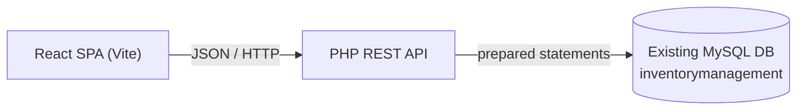
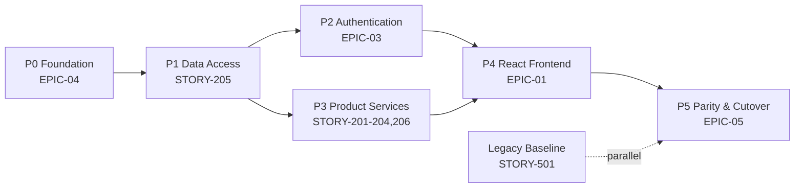

# Modernization Plan

## 1. Current State

A flat, procedural PHP application served from the XAMPP `htdocs` web root, with HTML, business logic, and SQL interleaved in each file ([login.php](../login.php), [table.php](../table.php), [additem.php](../additem.php), [edit.php](../edit.php), [delete.php](../delete.php)). It provides product CRUD and a single-admin login backed by a MySQL/MariaDB database ([inventorymanagement.sql](../inventorymanagement.sql)). Key problems: no session/auth enforcement, SQL injection, plaintext passwords, XSS, redundant hardcoded DB connections, a PRG violation in add, and no tests/build tooling.

## 2. Target Architecture

A decoupled two-tier design that **keeps the existing database unchanged**:

- **Frontend:** React SPA (login view, product list, add/edit forms) built with Vite, styled with Bootstrap/React-Bootstrap.
- **Backend:** PHP REST API exposing JSON endpoints, with a single shared connection, prepared statements, server-side validation, and token/session auth.
- **Database:** the same `product` and `user` tables and schema (only minimal backward-compatible hardening).

## 3. Modernization Goals

- Enforce authentication on every protected operation (no direct-URL bypass).
- Eliminate SQL injection via prepared statements and XSS via proper output handling.
- Replace plaintext passwords with hashed passwords.
- Separate presentation (React) from logic (PHP API) from data (MySQL).
- Introduce dependency management (Composer, npm) and a repeatable build/deploy.
- Preserve existing functionality and the current database schema.

## 4. Migration Strategy

An **incremental, strangler-style** migration rather than a big-bang rewrite:

1. Stand up the PHP REST API alongside the existing pages, reading/writing the same tables.
2. Harden data access (prepared statements, centralized connection, hashed passwords) behind the API.
3. Build the React SPA against the new API, one feature at a time (auth → list → add → edit → delete).
4. Switch the entry point from the legacy pages to the React app once feature parity is verified.
5. Retire the legacy `.php` view/action files.

## 5. Module Prioritization

1. **Authentication** (highest priority — closes the critical access-control/security gap).
2. **View Products** (foundational read path for the SPA).
3. **Add Product** (first write path; fixes PRG).
4. **Edit Product**.
5. **Delete Product** (move off `GET`, add confirmation).

## 6. Technology Mapping

| Current | Target |
| ------- | ------ |
| Procedural PHP pages | PHP REST API (controllers/routes, Composer) |
| `require`/`header` navigation | React Router client-side routing |
| Inline HTML in PHP | React components (JSX) |
| Bootstrap via CDN/local | Bootstrap/React-Bootstrap via npm + Vite |
| Ad-hoc `mysqli` connections | Single shared connection (PDO/`mysqli`) from [config.php](../config.php) |
| Raw concatenated SQL | Prepared/parameterized statements |
| Plaintext passwords | `password_hash` / `password_verify` |
| `alert`/`echo` feedback | JSON responses + HTTP status codes |

## 7. API Strategy

RESTful JSON endpoints mapped 1:1 from legacy files:

| Endpoint | Method | Replaces | Purpose |
| -------- | ------ | -------- | ------- |
| `/api/login` | POST | [login.php](../login.php) | Authenticate, return session/token |
| `/api/products` | GET | [table.php](../table.php) | List products |
| `/api/products` | POST | [additem.php](../additem.php) | Create product |
| `/api/products/{id}` | PUT | [edit.php](../edit.php) | Update product |
| `/api/products/{id}` | DELETE | [delete.php](../delete.php) | Delete product |

- Consistent JSON envelopes, proper status codes, server-side validation, CORS config, and auth middleware on all `/api/products*` routes.

## 8. Database Strategy

**Preserve the schema** (per scope — no database refactor). Only low-risk, backward-compatible hardening:

- Access exclusively via prepared statements (no schema change needed to fix injection).
- Migrate `user.password` to hashed values and widen the column to `varchar(255)`.
- Add a unique index on `user.email`.
- Optionally normalize both tables to `utf8mb4`.
- Keep table/column names (`product`, `user`, `product_id`, etc.) stable so API mappings remain valid.

## 9. UI Modernization Strategy

- Rebuild [index.html](../index.html) as a React **Login** page calling `/api/login`.
- Rebuild [table.php](../table.php) as a **Products** page (data table) fed by `/api/products`, with search/pagination.
- Implement **Add/Edit** as React forms/modals with client-side + server-side validation.
- Implement **Delete** with a confirmation dialog issuing a `DELETE` request.
- Escape/encode all rendered data by default (React handles this); replace `alert`/echo with inline UI feedback/toasts.

## 10. Risks

- **Feature-parity gaps** during incremental migration (mitigate with per-feature verification).
- **Auth migration** — hashing existing plaintext passwords requires a one-time migration/reset step.
- **CORS/session handling** between the SPA and API if hosted on different origins.
- **Regression risk** from centralizing connections and rewriting queries.
- **Scope creep** — pressure to also refactor the DB; must be resisted per agreed scope.
- **No existing tests** — changes lack a safety net until tests are added.

## 11. Assumptions

- The existing MySQL/MariaDB `inventorymanagement` schema remains the system of record.
- A single administrative user model is sufficient (no new roles required).
- The app continues to run on a PHP + MySQL host (local XAMPP for development).
- Bootstrap remains the visual design baseline.
- Database refactoring is explicitly out of scope; only frontend → React and backend → APIs.

## 12. Success Criteria

- No protected endpoint is reachable without authentication.
- No SQL injection or XSS in a security review; all queries parameterized.
- Passwords stored hashed; login works via the API.
- Full CRUD parity achieved through the React SPA + REST API.
- Single centralized DB connection; no per-file hardcoded credentials.
- Existing schema and data preserved; add-product refresh no longer duplicates records.

## 13. Rollback Strategy

- Keep the legacy `.php` pages deployable until the SPA + API reach verified parity (strangler approach allows instant fallback by pointing the entry route back to [index.html](../index.html)/[table.php](../table.php)).
- Version-control every phase so any step can be reverted via Git.
- Back up the database before the password-hashing/charset migration; keep a restore script.
- Feature-flag or route-switch the frontend so the legacy UI can be re-enabled without redeploying the backend.

## 14. Implementation Phases

1. **Phase 0 — Foundation:** add Composer/npm, centralize the DB connection in [config.php](../config.php), set up the API skeleton and React/Vite project.
2. **Phase 1 — Secure auth:** build `/api/login` with prepared statements + hashed passwords; migrate the seed account; add auth guards.
3. **Phase 2 — Read path:** `/api/products` + React product list.
4. **Phase 3 — Write paths:** `/api/products` POST (fix PRG), `PUT`, and `DELETE` with confirmation; React forms/modals.
5. **Phase 4 — Cutover:** switch entry point to the SPA, verify parity, retire legacy pages.
6. **Phase 5 — Hardening:** add validation, tests, CORS/SRI, logging, and documentation.

## 15. AI Implementation Notes

- **Respect scope:** modernize only the frontend (→ React) and backend (→ REST APIs); **do not refactor the database schema** beyond agreed hardening.
- **Security is non-negotiable:** every query parameterized, every protected route authenticated, all output encoded, passwords hashed.
- **Map endpoints 1:1** from legacy files ([login.php](../login.php), [table.php](../table.php), [additem.php](../additem.php), [edit.php](../edit.php), [delete.php](../delete.php)) to keep behavior traceable.
- **Single connection source:** implement data access through [config.php](../config.php); remove per-file hardcoded connections.
- **Preserve behavior semantics** (one-row login = success, immediate CRUD) while fixing enforcement gaps, the PRG bug, and typos.
- **Incremental & reversible:** keep legacy pages runnable until parity; back up the DB before any migration.

## 16. Modernization Phases (Detailed)

The modernization is delivered in six sequential phases that map to the Epics in [../jira/EPICS.md](../jira/EPICS.md) and the Tasks in [../jira/TASKS.md](../jira/TASKS.md). Each phase is a coherent, independently reviewable increment.

| Phase | Name | Primary Epic(s) | Purpose |
| ----- | ---- | --------------- | ------- |
| P0 | Foundation & Tooling | EPIC-04 | Managed dependencies, externalized config, repeatable build/deploy, project skeletons. |
| P1 | Data-Access Standardization | EPIC-02 (STORY-205) | Single, secure, parameterized data-access layer over the unchanged database. |
| P2 | Secure API-Based Authentication | EPIC-03 | Authentication service, enforced access control, secure credential handling. |
| P3 | Product Services (Backend) | EPIC-02 (STORY-201–204, 206) | Retrieve/create/update/delete services + consistent responses. |
| P4 | React Frontend | EPIC-01 | Login, list, add, edit, delete screens + shared navigation over the APIs. |
| P5 | Parity, Cutover & Hardening | EPIC-05 (+ EPIC-04 close-out) | Baseline, regression, parity verification, cutover, and final hardening. |

## 17. Execution Sequence

The strict order below respects the dependency chain (data access → services/auth → frontend → parity):

1. **P0 Foundation** — establish tooling and configuration before any code depends on them.
2. **P1 Data Access** — the shared layer every backend service consumes.
3. **P2 Authentication** — depends on P1; unblocks protected access and the login screen.
4. **P3 Product Services** — depend on P1; consumed by the frontend.
5. **P4 Frontend** — depends on P2 (auth) and P3 (services).
6. **P5 Parity & Cutover** — depends on P2–P4 being feature-complete; gates go-live.

Baseline capture (STORY-501) may begin in parallel with P0 since it only touches the legacy app.

## 18. Implementation Roadmap

- **Backend track:** P0 → P1 → (P2 ∥ P3).
- **Frontend track:** starts once P2 and the relevant P3 service are available; each screen follows its service.
- **Assurance track:** baseline early; regression grows with each phase; parity verification closes the program.

## 19. Milestone Definitions

| Milestone | Marker | Exit Signal |
| --------- | ------ | ----------- |
| M0 — Foundation Ready | P0 complete | Dependencies managed, config externalized, build/deploy repeatable. |
| M1 — Secure Data Access | P1 complete | All data access flows through one parameterized layer; DB unchanged. |
| M2 — Auth Enforced | P2 complete | API-based login works; no protected operation reachable unauthenticated; credentials secured. |
| M3 — Services Complete | P3 complete | All product services pass tests with parity to legacy. |
| M4 — Frontend Complete | P4 complete | All screens operate against the APIs with parity to legacy. |
| M5 — Parity Verified | P5 parity done | Full legacy-vs-modern parity across behavior, API, UI, and database. |
| M6 — Cutover Done | P5 cutover done | Entry point switched to the SPA; legacy retired; hardening complete. |

## 20. Dependency Ordering

- **STORY-205 (data access)** precedes all backend services (STORY-201–204) and authentication (STORY-301).
- **STORY-301 (auth)** precedes access enforcement (STORY-302), credential security (STORY-303), and the login screen (STORY-101).
- **Each backend service** precedes its matching frontend screen (201→102, 202→103, 203→104, 204→105).
- **STORY-206 (consistent responses)** follows the services it standardizes (201–204).
- **STORY-106 (shell/navigation)** follows the individual screens (101–105).
- **STORY-501 (baseline)** precedes **STORY-502 (regression)** which precedes **STORY-503 (parity)**.
- **EPIC-04 tooling** underpins all build/run activities and is sequenced first.

## 21. Rollout Strategy

- **Strangler coexistence:** run the modern API + SPA alongside the legacy pages against the same database; no data migration.
- **Feature-by-feature enablement:** route each modernized screen live only after its service and parity checks pass.
- **Single cutover switch:** flip the entry point from [../index.html](../index.html) to the SPA once M5 (parity verified) is reached.
- **Staged environments:** promote through Development → Test/Staging → Production using the repeatable build/deploy.
- **Go-live gate:** cutover requires M5 parity sign-off (STORY-503) and a clean security pass.

## 22. Rollback Strategy (Detailed)

- **Instant fallback:** because legacy pages remain deployable, revert the entry route to the legacy UI to restore the previous behavior without a backend redeploy.
- **Per-phase reversibility:** every phase is version-controlled; any increment can be reverted via Git without affecting the database.
- **Database safety:** back up the database before the credential-hardening step; keep a tested restore script. Since there are no schema changes to product data, rollback of app tiers does not require data rollback.
- **Credential migration fallback:** retain a documented admin re-seed/reset procedure in case the credential-security step needs reversal.
- **Trigger conditions:** failed parity verification, a critical security finding, or a failed smoke test in production triggers rollback to the last good state.

## 23. Definition of Done per Phase

- **P0 — Foundation:** dependencies managed for both tiers; environment configuration externalized (no secrets in source); build and deploy are repeatable and documented; reviews (TASK-401-2/402-2/403-2) and validations (TASK-401-3/402-3/403-3) pass.
- **P1 — Data Access:** one shared, parameterized data-access layer in use; no per-file connections; schema and data verified unchanged; TASK-205-2 review and TASK-205-3 data-integrity tests pass.
- **P2 — Authentication:** API-based login matches legacy outcomes; all protected operations require authentication; credentials stored/verified securely; TASK-301/302/303 reviews and parity tests pass.
- **P3 — Product Services:** retrieve/create/update/delete services and consistent responses match legacy behavior; reviews and legacy-vs-modern service tests (2xx-2 / 2xx-3) pass; DB unchanged.
- **P4 — Frontend:** every screen and shared navigation operate against the APIs with parity to legacy; reviews and UI parity tests (1xx-2 / 1xx-3) pass with screenshots.
- **P5 — Parity & Cutover:** legacy baseline captured and reviewed; regression suite complete; full parity verified across behavior/API/UI/database (STORY-503); cutover executed; rollback validated; documentation updated.